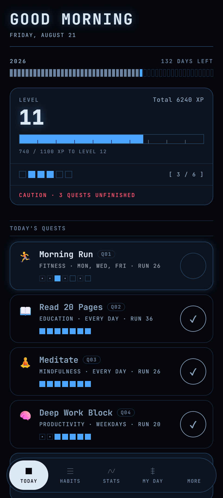
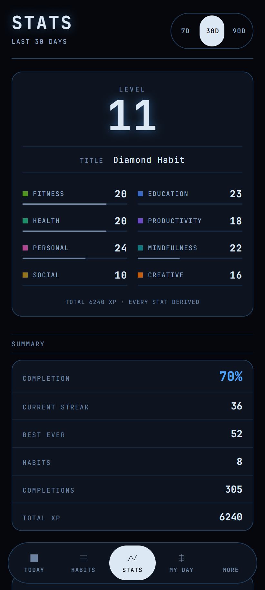
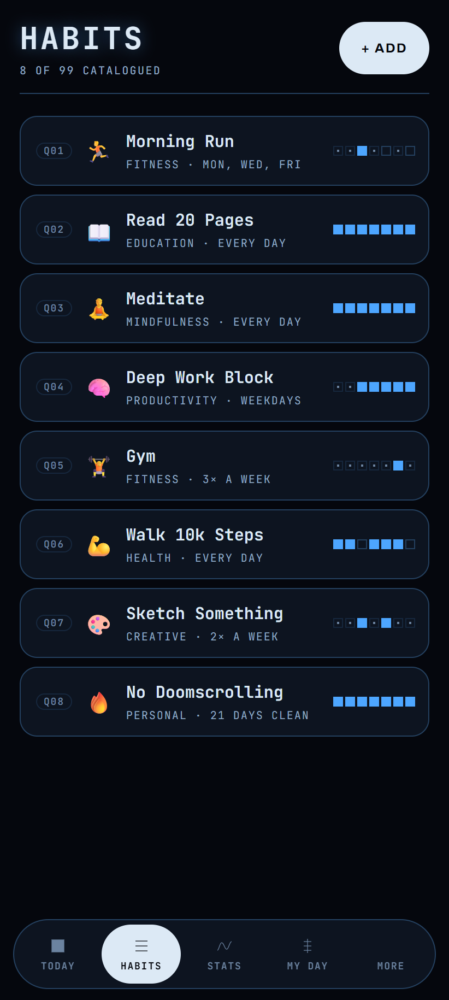
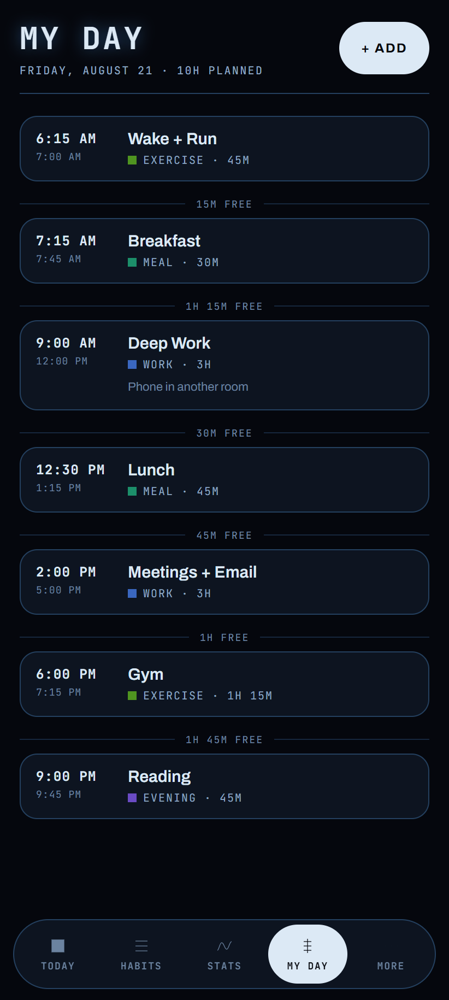
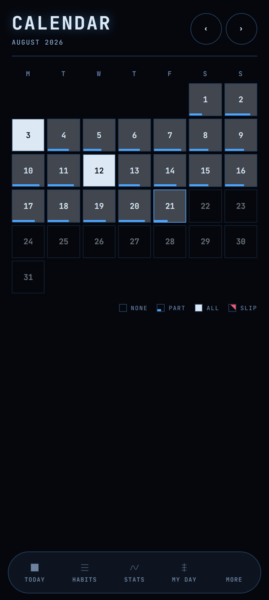
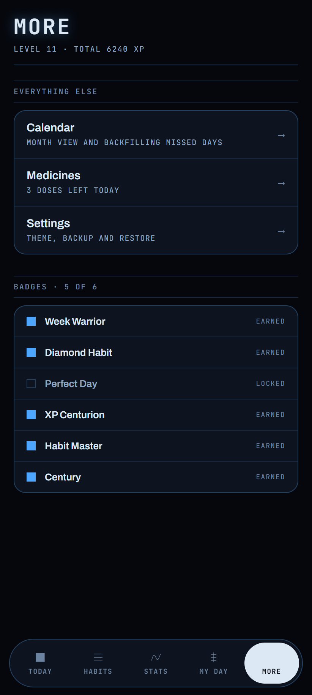
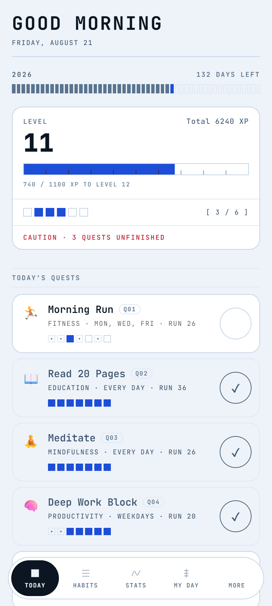
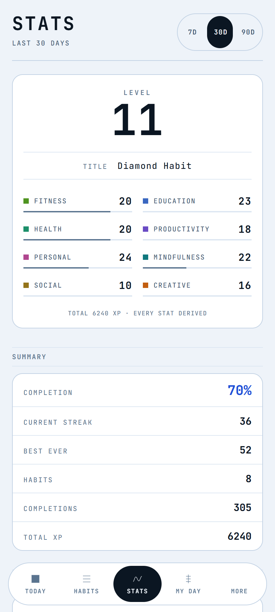

# LifeRPG

A gamified, offline-first habit tracker for **Android** and the **web**.
Track habits with streaks and XP, log medicines, plan your day, and see where your
time actually goes — with no account, no server, and no internet connection.

[](https://github.com/krishn1301/Liferpg/actions/workflows/ci.yml)
[](https://github.com/krishn1301/Liferpg/releases/latest)
[](LICENSE)


**[▶ Open the live web app](https://krishn1301.github.io/Liferpg/)** ·
**[⬇ Download the Android APK](https://github.com/krishn1301/Liferpg/releases/latest)**

| Today | Stats | Habits | My Day |
| --- | --- | --- | --- |
|  |  |  |  |

<details>
<summary>More screens — calendar, badges, and the light theme</summary>

| Calendar | Badges | Today (light) | Stats (light) |
| --- | --- | --- | --- |
|  |  |  |  |

</details>

> Screenshots use a generated demo document, not real personal data.

---

## How it's built

The parts worth pointing at in a code review:

**Derived, never stored.** XP, levels, streaks, completion rates and badges are all
computed from the completion history on read. Nothing is a counter that gets incremented,
so nothing can drift out of sync with the events that produced it, and there is no
migration to write when the XP formula changes.

**One predicate, one answer.** `isDueOn` (`src/domain/schedule.js`) decides whether a habit
is expected on a given day, and the Today list, the weekly grid, streaks, the calendar and
every percentage all call it. The desktop app this replaced treated every habit as daily,
so a Mon/Wed/Fri gym habit showed a broken streak every Tuesday and a completion rate
capped at 43%. Percentages disagreeing with each other is a class of bug, and a single
shared predicate is the fix for the whole class.

**A domain layer with no dependencies.** `src/domain/` imports no React, no Capacitor and
no browser API, so the rules that actually matter — what counts as a streak, which day a
completion belongs to, when a vow is broken — are tested without a DOM or a device.
**345 tests across 24 files**, and the interesting ones are about calendars and edge dates
rather than about rendering.

**One codebase, two shipping targets.** The same source ships as an installable PWA on
iPhone via GitHub Pages and as a signed APK on Android via Capacitor. `src/platform/` is
the only directory that knows which one it is running on, and every function there is safe
to call on either — so no caller carries a platform branch.

**Native code where the web cannot reach.** Step counting is a small Capacitor plugin
written in Java against Android's `TYPE_STEP_COUNTER`, which reports steps since boot and
batches its readings — so the plugin flushes the sensor FIFO, and the app stores a per-day
baseline rather than trusting the raw number.

**A design system with measured contrast.** The colour decisions in [DESIGN.md](DESIGN.md)
are recorded with computed contrast ratios against all four grounds (light/dark ×
panel/page) rather than eyeballed. Category colour was moved off red once red already
meant "danger" and "relapse".

**CI that signs and publishes.** Pushing a `v*` tag runs the tests, then builds, signs and
verifies an APK with a keystore held in repository secrets, and attaches it to a GitHub
Release. Pushing to `main` deploys the web app.

## Status

Feature-complete for its three users. All eight screens work, the data is real, and the
visual language is the one described in [DESIGN.md](DESIGN.md) — a record catalogue, not
the desktop app's inherited grey. See [PRODUCT.md](PRODUCT.md) for what the product is
actually for, and [SPEC.md](SPEC.md) for the behaviour it promises.

## Install

**Android** — download the APK from the latest [Release] and open it. You will have to
allow install from unknown sources once; it is not on the Play Store.

**iPhone** — open the [web app](https://krishn1301.github.io/Liferpg/) in Safari, then
**Share → Add to Home Screen**. iOS has no install prompt, so nothing will offer this to
you. Running it from the home screen rather than a browser tab matters: iOS is much more
willing to clear a tab's storage to reclaim space, and that storage is your entire history.

The two installs are separate apps with separate data. There is no sync, and none is
planned. Export a backup from Settings if you want to move between them.

**Reminders only work on Android.** iOS Safari cannot schedule a local notification, and
Web Push would need a server this app deliberately does not have. Settings says so.

[Release]: ../../releases/latest

## Stack

|                |                                                                          |
| -------------- | ------------------------------------------------------------------------ |
| UI             | React 19 + Vite 8                                                        |
| Android shell  | Capacitor 8 (`android/` is committed)                                    |
| Web app        | `vite-plugin-pwa` — installable, offline                                 |
| Storage        | `@capacitor/preferences` (native storage on Android, `localStorage` on web) |
| Type           | Archivo + JetBrains Mono, self-hosted via `@fontsource-variable`         |
| Charts         | none — the trend plot and code strips are hand-drawn SVG and divs        |
| Tests          | Vitest                                                                   |
| CI             | GitHub Actions — signed APK on tag, Pages deploy on `main`               |

Nothing here needs Android Studio or the Android SDK locally. CI does the Gradle build.

## Develop

```bash
npm install
npm run dev      # http://localhost:5173 — use device toolbar at phone dimensions
npm test
npm run lint
npm run icons    # regenerate the app icons from the design system
```

Local notifications and haptics are **native-only** and cannot be exercised in a browser.
Test those on a real device using a CI-built APK. [TESTING.md](TESTING.md) covers the
device rig.

## Ship a release

```bash
# bump "version" in package.json first
git tag v0.1.0
git push origin main --tags
```

The `Android Release` workflow builds, signs, verifies and attaches
`LifeRPG-v0.1.0.apk` to a GitHub Release. Send testers that Release page.

`workflow_dispatch` builds a signed APK as a workflow artifact without cutting a release —
useful for testing a change on a device.

## One-time repo setup

Create the GitHub repo, then add these four **repository secrets**
(Settings → Secrets and variables → Actions):

| Secret               | Value                                                                                    |
| -------------------- | ---------------------------------------------------------------------------------------- |
| `KEYSTORE_BASE64`    | base64 of `liferpg-release.jks`                                                          |
| `KEYSTORE_PASSWORD`  | the store password                                                                       |
| `KEY_ALIAS`          | `liferpg`                                                                                |
| `KEY_PASSWORD`       | same as `KEYSTORE_PASSWORD` (PKCS12 keystores can't have a separate key password)        |

Then enable Pages: Settings → Pages → Source = **GitHub Actions**.

### About the keystore

`liferpg-release.jks` in the repo root is **gitignored and irreplaceable**. Android
identifies an app by its signature, so if you lose this file you cannot ship an update
that installs over an existing copy — every tester would have to uninstall first and lose
their data. Back it up somewhere permanent and offline.

`android/keystore.properties` (also gitignored) points local release builds at it.

## Project layout

```
src/
  platform/     the only code that knows whether it's on Android or the web
  domain/       pure logic — dates, schedules, streaks, XP. No React, no plugins.
  state/        one document, one reducer, debounced autosave
  screens/      one file per screen
  components/   shared UI — ui.jsx is the primitives, catalog.jsx the world's own devices
  theme/        design tokens, light + dark
scripts/        build tooling (icon generation)
android/        Capacitor's native project (committed)
legacy/         the original Electron desktop app, kept for reference during the port
```

`domain/` is deliberately dependency-free so the rules that matter — what counts as a
streak, which day a completion belongs to — are testable without a browser or a phone.

## License

[MIT](LICENSE).
